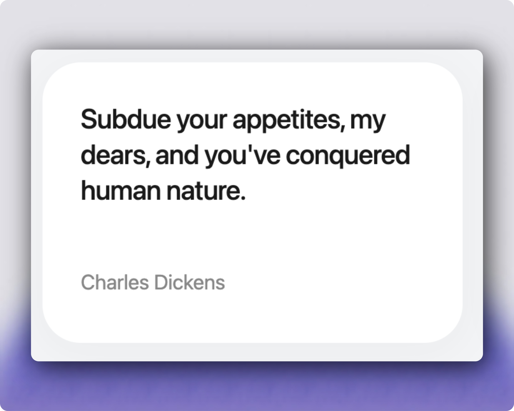

# Quote



A small React + Vite app that fetches and displays quotes from a public API with simple pagination and per-page controls.

## Features
- Fetches quotes from https://api.freeapi.app
- Grid layout of quote cards
- Pagination: Prev/Next and adjustable items-per-page

## Getting started
Prerequisites: Node.js (16+), npm or pnpm

```bash
npm install
npm run dev
```

Build:

```bash
npm run build
```

Image source: `public/demo.jpg`.

